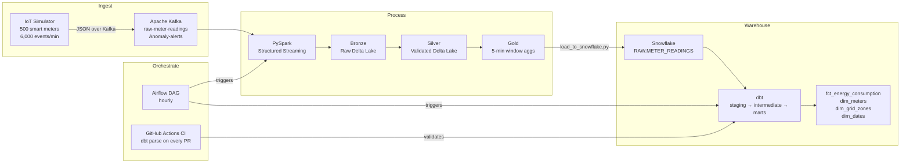
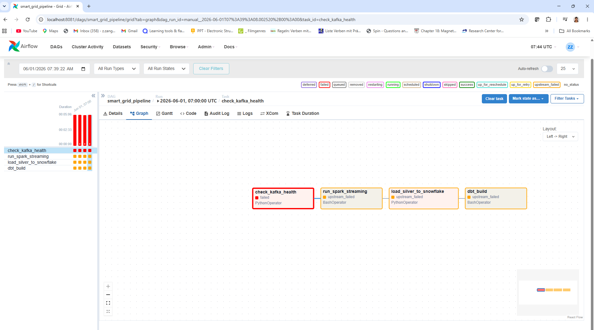
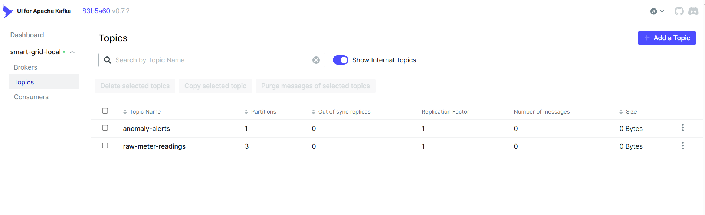
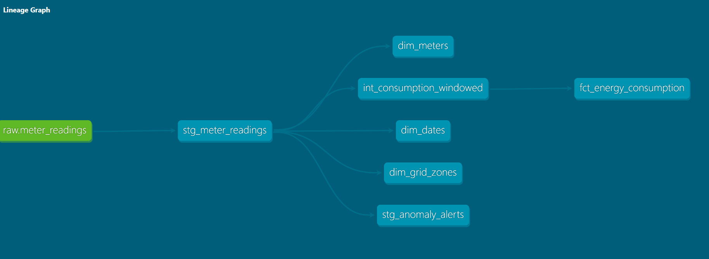

# ⚡ Smart Grid Stream

> A real-time IoT data engineering platform simulating, processing, and analyzing energy consumption across German power grid zones — built end-to-end with a modern streaming stack.


---

## 💡 Why I Built This

Germany's Energiewende is transforming how energy is produced, distributed, and consumed. Across the grid, millions of sensors and smart meters generate a continuous stream of operational data that must be processed, monitored, and analyzed in near real time.

As a data engineer based in NRW, I wanted to build a project around a problem that is both technically interesting and highly relevant to the region: how can large-scale smart meter data be ingested, processed, modeled, and made available for analytics in a modern cloud-native data platform?

This project is my answer.

Rather than following a tutorial or reproducing an existing example, I designed the architecture, selected the technology stack, and implemented the platform end to end. The system simulates hundreds of IoT smart meters across NRW grid zones, streams live consumption events through Kafka, processes them with Spark, stores them in a Medallion architecture, and delivers curated analytical models through dbt and Snowflake.

Professionally, much of my experience has been in designing and implementing data warehouse solutions within regulated industries. Building this project allowed me to apply the same data engineering fundamentals—data modeling, data quality, governance, orchestration, and scalability—to a modern streaming and ELT architecture.

One of the key observations from this work is that while the technology stack continues to evolve, the core principles of good data engineering remain the same. Modern platforms provide new capabilities, but success still depends on thoughtful architecture, reliable pipelines, and well-designed data models.

This repository documents the architecture, implementation decisions, and lessons learned from building a production-inspired streaming data platform from the ground up.

---

## 🏗️ Architecture



---

## 📸 Screenshots

**Airflow DAG — all 4 tasks green**


**Kafka UI — live message stream**


**dbt lineage graph**


---

## 📊 Pipeline Metrics

| Metric | Value |
|---|---|
| Virtual smart meters | 500 |
| Grid zones | NRW-North, NRW-South, Bavaria, Saxony, Hamburg |
| Event throughput | ~6,000 events / minute |
| Kafka topic partitions | 3 (keyed by meter_id) |
| Streaming window | 5-minute tumbling, 2-minute watermark |
| Anomaly rate | ~2% of readings (consumption spike ≥ 2.5×) |
| dbt models | 7 (2 staging, 1 intermediate, 4 marts) |
| dbt tests | 27 — 100% passing |
| Bronze Delta files written | 930 |
| Silver Delta files written | 894 |
| Gold Delta files written | 280 |

---

## 🧠 Key Engineering Decisions

**Why `kafka-python-ng` instead of `kafka-python`?**
`kafka-python` is unmaintained and broken on Python 3.12+. `kafka-python-ng` is the community-maintained drop-in replacement. Switching requires changing only one line in requirements.txt — the right call for any new project in 2026.

**Why watermarks on the Gold layer?**
Smart meter data arrives out of order due to network conditions and device buffering. Without a watermark, PySpark would hold state indefinitely for every open window. The 2-minute watermark lets Spark handle late events while bounding memory usage — silently broken aggregations without it are a common production incident.

**Why key Kafka messages by `meter_id`?**
Stateful streaming aggregations require all events for the same key to land in the same partition. Keying by `meter_id` guarantees this. Using a random or round-robin key would cause incorrect windowed aggregations downstream — a subtle but critical correctness requirement.

**Why local Delta Lake instead of Azure Databricks?**
Azure free tier limits vCPU quota to 4 cores — too small for a Databricks cluster. Running PySpark locally with Delta Lake preserves the exact same API and Medallion architecture. The code is cloud-ready with a single config change (`master("local[*]")` → Databricks cluster URL).

**Why `dbt parse` in CI instead of `dbt build`?**
`dbt build` requires a live Snowflake connection, which means CI would consume warehouse credits on every PR. `dbt parse` validates all Jinja templates, SQL syntax, and model references without any database connection — fast, free, and catches the majority of real errors before merge.

**Why incremental materialization on `fct_energy_consumption`?**
The fact table grows continuously as new meter readings arrive. Recomputing the full table on every dbt run would re-aggregate all historical data. The incremental model only processes new hours since the last run, which scales linearly rather than quadratically with data volume.

---

## 🛠️ Tech Stack

| Layer | Technology | Why |
|---|---|---|
| Event streaming | Apache Kafka (Confluent 7.5) | Industry standard; partition-keyed for stateful aggregations |
| Stream processing | PySpark 3.5.3 + Delta Lake 3.2.0 | Native windowing; watermarks; ACID transactions on streaming data |
| Medallion storage | Delta Lake (local) / Azure ADLS Gen2 (cloud) | Same API locally and in cloud; time-travel for debugging |
| Data warehouse | Snowflake | Separation of storage and compute; auto-suspend on idle |
| Transformation | dbt Core 1.11 + dbt-utils | Version-controlled SQL; lineage graph; incremental models |
| Orchestration | Apache Airflow 2.9 (Docker) | DAG-based scheduling; task-level retry; clear failure visibility |
| CI/CD | GitHub Actions | dbt parse on every PR — no broken models reach main |

---

## 📁 Project Structure

```
smart-grid-stream/
├── iot_simulator/
│   ├── simulator.py                  # 500 virtual meters → Kafka
│   ├── simulator_eventhub.py         # Azure Event Hubs variant
│   └── requirements.txt
├── kafka/
│   ├── docker-compose.yml            # Kafka + Zookeeper + Kafka UI (port 8080)
│   └── setup_topics.sh
├── spark_streaming/
│   ├── stream_processor_local.py     # PySpark Medallion pipeline (local Delta Lake)
│   └── stream_processor_eventhub.py  # Azure Event Hubs + ADLS variant
├── smart_grid_dbt/
│   ├── models/
│   │   ├── staging/                  # stg_meter_readings, stg_anomaly_alerts
│   │   ├── intermediate/             # int_consumption_windowed
│   │   └── marts/                    # fct_energy_consumption, dim_meters,
│   │                                 # dim_grid_zones, dim_dates
│   ├── packages.yml                  # dbt-utils dependency
│   └── dbt_project.yml
├── orchestration/
│   ├── docker-compose.yml            # Airflow 2.9 + PostgreSQL (port 8081)
│   ├── dbt_profiles/profiles.yml     # dbt profile reading from env vars
│   └── dags/
│       └── smart_grid_dag.py         # Hourly pipeline DAG (4 tasks)
├── load_to_snowflake.py              # Silver Delta → Snowflake RAW loader
└── .github/
    └── workflows/
        └── dbt_ci.yml                # dbt parse on every PR to main
```

---

## 🚀 Getting Started

### Prerequisites
- Python 3.12
- Docker Desktop
- Java 11+ (for PySpark)
- Snowflake account (free trial at snowflake.com)

### 1 — Clone and install

```bash
git clone https://github.com/zibazangeneh/smart-grid-stream.git
cd smart-grid-stream
pip install -r iot_simulator/requirements.txt
```

### 2 — Start Kafka

```bash
cd kafka
docker compose up -d
```

Kafka UI: `http://localhost:8080`

### 3 — Run the IoT simulator

```bash
python iot_simulator/simulator.py
```

### 4 — Run PySpark Medallion pipeline

```bash
# Windows — set HADOOP_HOME first
$env:HADOOP_HOME = "C:\hadoop"
python spark_streaming/stream_processor_local.py
```

Writes Bronze / Silver / Gold Delta tables to `data/`.

### 5 — Load to Snowflake and run dbt

```bash
$env:SNOWFLAKE_PASSWORD = "your-password"
python load_to_snowflake.py

cd smart_grid_dbt
dbt deps
dbt build
```

### 6 — Start Airflow

```bash
cd orchestration
$env:SNOWFLAKE_PASSWORD = "your-password"
docker compose up airflow-init
docker compose up -d airflow-webserver airflow-scheduler
```

Airflow UI: `http://localhost:8081` — login: `admin` / `admin`

---

## 📊 Message Schema

Each smart meter sends a JSON reading every 5 seconds:

```json
{
  "meter_id":    "METER-0247",
  "timestamp":   "2026-05-20T09:15:32Z",
  "kwh_reading": 3.4521,
  "voltage":     229.4,
  "frequency":   50.01,
  "grid_zone":   "NRW-North",
  "meter_type":  "residential",
  "is_anomaly":  false
}
```

---

## ❓ Business Questions This Platform Answers

1. Which NRW grid zones consume the most energy per hour?
2. Which meters show anomalous consumption spikes — and when?
3. What is the peak demand window per day across the grid?
4. How does consumption differ between residential, commercial, and industrial meters?
5. Which zones show the highest anomaly rate over time?

---

## 🔐 Environment Variables

No secrets are hardcoded. Set these before running:

| Variable | Used in | Description |
|---|---|---|
| `SNOWFLAKE_PASSWORD` | load_to_snowflake.py, Airflow | Snowflake account password |
| `KAFKA_BROKER` | simulator.py, stream_processor | Kafka broker (default: localhost:9092) |
| `HADOOP_HOME` | stream_processor_local.py | Path to Hadoop winutils (Windows only) |

GitHub Actions secrets: `SNOWFLAKE_ACCOUNT`, `SNOWFLAKE_USER`, `SNOWFLAKE_PASSWORD`

---

## 📈 Project Status

- [x] **Week 1** — Kafka setup + IoT simulator (500 smart meters, 5 German grid zones)
- [x] **Week 2** — PySpark Structured Streaming + local Delta Lake Medallion architecture (Bronze → Silver → Gold)
- [x] **Week 3** — dbt star schema on Snowflake (staging + intermediate + marts + tests, 27/27 passing)
- [x] **Week 4** — Airflow orchestration + GitHub Actions CI/CD (dbt parse on every PR)

---

## 👩‍💻 About Me

I am a data engineer with a PhD in Physics, based in Aachen, NRW. My background is in pharma/life sciences data pipelines — ETL, data governance, GDPR compliance. I built this project to expand into modern cloud-native streaming, which is where the German data engineering market is heading in 2026.

📍 Aachen, NRW · 🇩🇪 German citizen · Open to Senior Data Engineer roles in NRW

---

*Built by Dr. Ziba Zangenehpourzadeh · 2026*
